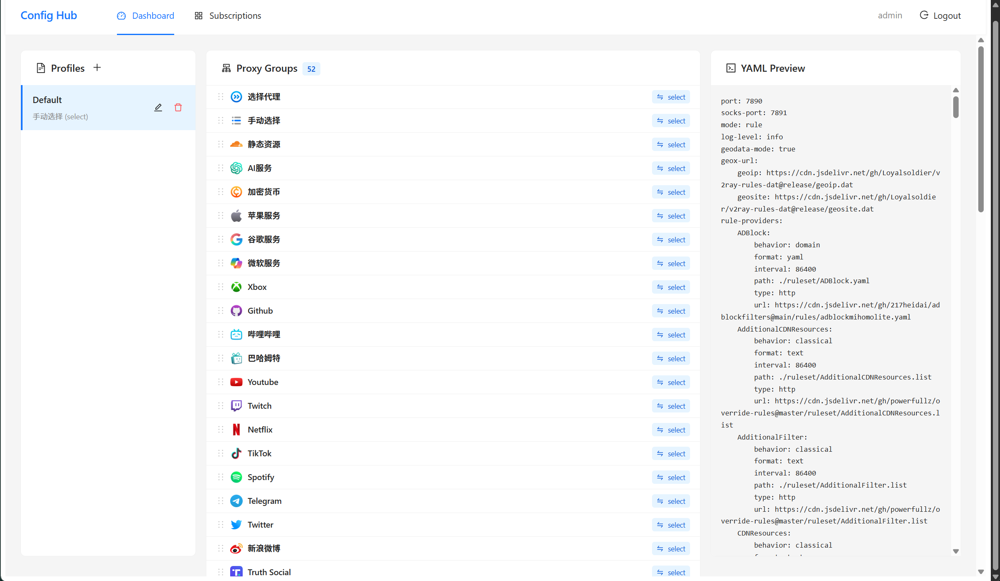

# Config Hub

> [!WARNING]
> 还在搓，暂时不要使用。

> "Work in Progress" — 机场订阅聚合 + Mihomo 配置管理



一个自托管的代理配置管理中心。拉取多个机场订阅源，统一管理节点，自动生成 Mihomo (Clash Meta) 兼容的 YAML 配置文件，并通过独立 Token 分发给各个客户端。

## 功能

- **订阅聚合**: 添加多个机场订阅 URL，统一拉取和管理所有节点，支持定时自动刷新
- **智能分类**: 自动识别节点所属国家/地区（香港、日本、新加坡等 22 个地区），区分低倍率节点和落地节点
- **配置生成**: 基于预设模板（52 个代理组 + 37 条规则）自动生成 Mihomo 兼容的完整 YAML 配置
- **可视化编辑**: Web GUI 管理订阅源、查看节点统计、管理配置档案、拖拽排序代理组与规则
- **Token 分发**: 每个配置档案生成独立的分发 Token，客户端通过 `/sub` 端点获取配置，Token 支持吊销
- **单文件部署**: Go 编译时将 React 前端嵌入二进制，一个文件即可运行，也支持 Docker 部署

## 快速开始

### 前置依赖

- Go 1.26+
- Node.js 24+ / pnpm

### 构建前端

```bash
cd web
pnpm install
pnpm build          # 输出到 web/dist/
```

### 构建后端

```bash
# 在项目根目录
go build -ldflags="-s -w" -o config-hub .
```

### 运行

```bash
./config-hub
```

服务默认监听 `http://localhost:1323`，首次启动自动创建数据库和种子数据。

### 登录

打开浏览器访问 `http://localhost:1323`，使用默认用户 `admin` 登录。

首次启动时系统会随机生成 admin 密码并打印在日志中：
```
time=... level=INFO msg="Seed data created" user=admin password=<24位随机hex> profile=Default groups=52 rules=37
```
请妥善保管此密码。删除数据库文件 (`config-hub.db`) 并重启可重新生成密码。

首次登录后建议通过注册接口创建新用户（设置 `ENABLE_REGISTRATION=true`）并禁用 admin 用户。

### Docker

```bash
# 使用 docker-compose（推荐）
docker-compose up -d

# 或手动构建并运行
docker build -t config-hub .
docker run -p 1323:1323 -v $(pwd)/data:/data config-hub
```
首次运行时查看日志获取 admin 密码：
```bash
docker logs config-hub 2>&1 | grep password
```

### 环境变量

| 变量                  | 默认值               | 说明                       |
| -------------------- | -------------------- | -------------------------- |
| `DB_PATH`            | `config-hub.db`      | SQLite 数据库文件路径       |
| `PORT`               | `1323`               | HTTP 监听端口               |
| `ENABLE_REGISTRATION` | `false`              | 是否允许公开注册新用户       |

## 核心 API

| 方法   | 路径                                     | 认证  | 说明                                                  |
| ------ | ---------------------------------------- | ----- | ----------------------------------------------------- |
| POST   | `/api/auth/login`                        | 无    | 用户登录，返回 JWT                                    |
| POST   | `/api/auth/register`                     | 无    | 注册新用户（可通过 `ENABLE_REGISTRATION=false` 禁用） |
| GET    | `/api/auth/me`                           | JWT   | 获取当前用户信息                                      |
| GET    | `/api/subscriptions`                     | JWT   | 列出所有订阅源                                        |
| POST   | `/api/subscriptions`                     | JWT   | 添加订阅源                                            |
| PUT    | `/api/subscriptions/:id`                 | JWT   | 更新订阅源                                            |
| DELETE | `/api/subscriptions/:id`                 | JWT   | 删除订阅源                                            |
| POST   | `/api/subscriptions/:id/refresh`         | JWT   | 手动刷新订阅源                                        |
| GET    | `/api/nodes`                             | JWT   | 查询节点列表（支持 country/protocol/search 过滤）     |
| GET    | `/api/nodes/stats`                       | JWT   | 节点统计（按国家/协议/订阅分组）                      |
| GET    | `/api/profiles`                          | JWT   | 列出配置档案                                          |
| POST   | `/api/profiles`                          | JWT   | 创建配置档案                                          |
| GET    | `/api/profiles/:id`                      | JWT   | 获取档案详情（含代理组和规则）                        |
| PUT    | `/api/profiles/:id`                      | JWT   | 更新档案设置                                          |
| DELETE | `/api/profiles/:id`                      | JWT   | 删除档案                                              |
| POST   | `/api/profiles/:id/subscriptions`        | JWT   | 向档案添加订阅源                                      |
| DELETE | `/api/profiles/:id/subscriptions/:subId` | JWT   | 从档案移除订阅源                                      |
| POST   | `/api/profiles/:id/tokens`               | JWT   | 生成分发 Token（仅返回一次）                          |
| GET    | `/api/profiles/:id/tokens`               | JWT   | 列出档案的 Token 列表                                 |
| DELETE | `/api/profiles/:id/tokens/:tokenId`      | JWT   | 吊销 Token（软删除）                                  |
| GET    | `/api/profiles/:id/preview`              | JWT   | 预览生成的 YAML 配置                                  |
| GET    | `/api/profiles/:id/export`               | JWT   | 下载 YAML 配置文件                                    |
| GET    | `/sub/:profileId?token=xxx`              | Token | 客户端订阅端点，返回 YAML 配置                        |

## 文档

更多细节请参考 `docs/` 目录：

| 文档 | 说明 |
| ---- | ---- |
| [项目结构](docs/project-structure.md) | 完整目录结构、技术栈、安全特性 |
| [API 参考](docs/API.md) | 全部 API 端点详细说明 |
| [架构设计](docs/ARCHITECTURE.md) | 系统架构与数据流 |
| [种子数据](docs/SEED_DATA.md) | 预置数据说明 |
